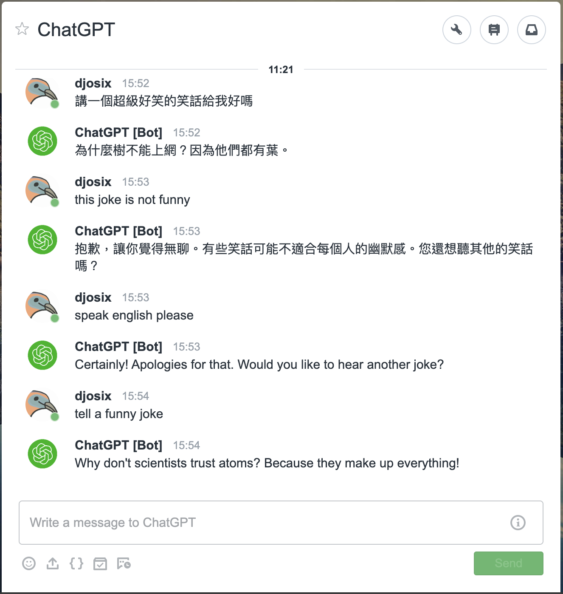
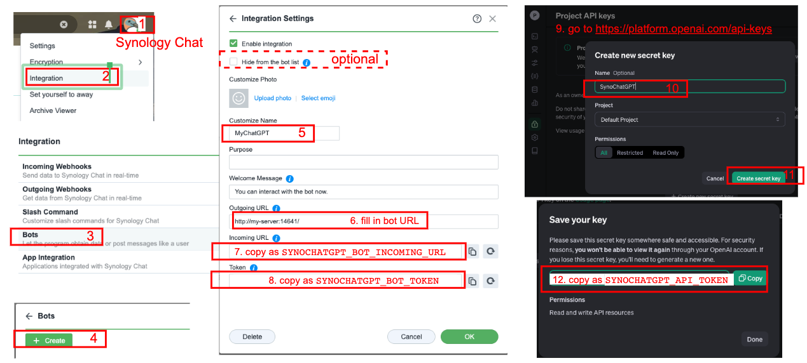

# SynoChatGPT

ChatGPT 3.5 bot on Synology Chat.



```sh
git clone https://github.com/djosix/SynoChatGPT.git
cd SynoChatGPT
docker build -t synochatgpt .

# Start the bot server
docker run --name synochatgpt --restart=unless-stopped -d -p "14641:14641" \
    -e SYNOCHATGPT_LISTEN_ADDR=":14641" \
    -e SYNOCHATGPT_BOT_INCOMING_URL="XXX" \
    -e SYNOCHATGPT_BOT_TOKEN="YYY" \
    -e SYNOCHATGPT_API_TOKEN="ZZZ" \
    synochatgpt
```



- Create API token: https://platform.openai.com/api-keys
